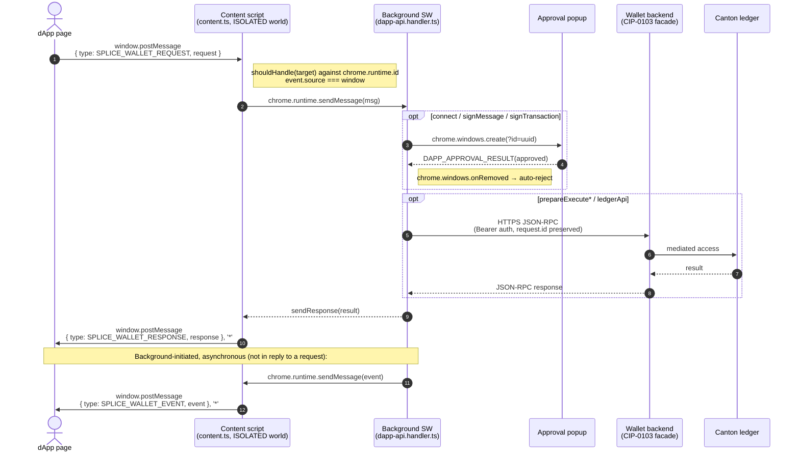

# Architecture

When a dApp calls a Ginkgo method, the request travels through four contexts before any work happens. Knowing this map saves hours of debugging when something goes wrong.

## Message flow

The return path mirrors the request: backend → background → content script → `window.postMessage` to the dApp's `message` listener. Replies are posted with `targetOrigin: '*'` because the content script runs on every URL and the dApp's origin isn't known to the wallet.

Side-channels not shown as a main flow but worth knowing about:

- **Discovery handshake** (EIP-6963-style). The SDK announces itself with `canton:requestProvider`; the content script replies with `canton:announceProvider`. A separate `SPLICE_WALLET_EXT_READY` / `SPLICE_WALLET_EXT_ACK` ping lets the SDK detect a wallet from popup contexts where the custom events don't propagate.
- **MAIN-world bridge.** A second content script (`entrypoints/provider.content.ts`) runs in the page's MAIN world specifically so messages reach `window.opener` listeners in SDK discovery popups. The ISOLATED-world `content.ts` carries the JSON-RPC traffic.
- **Approval popup loop.** For methods requiring user approval, the background generates a `requestId`, opens a popup with `?id=<uuid>`, and resolves a pending Promise on `DAPP_APPROVAL_RESULT`. If the user closes the popup without deciding, `chrome.windows.onRemoved` auto-rejects the pending call.
- **Event push channel.** `statusChanged` / `accountsChanged` are pushed from the background through the content script as `SPLICE_WALLET_EVENT`, not as replies to any specific request. See [extensions](../extensions/ginkgo-vs-cip-0103.md).

## The four contexts

### 1. dApp page

Your code. Runs in the page's normal JavaScript context with the page's origin. No special permissions. Talks to Ginkgo *only* through `window.postMessage` (or the SDK wrapping it).

### 2. Content script

Lives at `entrypoints/content.ts` in the wallet's source. Runs in an *isolated* world — it shares the DOM with your page but has its own JS heap. The bridge between page-context `window.postMessage` and extension-context `chrome.runtime.sendMessage`. Also handles:

- **Provider discovery** — listens for `canton:requestProvider`, dispatches `canton:announceProvider` with Ginkgo's identity. A companion script at `entrypoints/provider.content.ts` runs in the page's MAIN world so the discovery handshake also reaches popup contexts (`window.opener` listeners), where ISOLATED-world events don't propagate.
- **Wallet-presence ping** — answers `SPLICE_WALLET_EXT_READY` with `SPLICE_WALLET_EXT_ACK`, separate from the request/response cycle. The SDK uses this to detect Ginkgo is installed before sending any JSON-RPC.
- **Target routing** — checks `msg.target` against `chrome.runtime.id`; ignores messages addressed to a different wallet.
- **Same-window filtering** — drops messages whose `event.source !== window` to prevent iframe injection.
- **Reply origin** — posts responses with `targetOrigin: '*'`. Since the content script runs on all URLs, the wallet doesn't pin the dApp's origin at this hop; correlation is the dApp's responsibility via JSON-RPC `request.id`.

### 3. Background service worker

MV3 service worker at `entrypoints/background.ts`. Holds the user's session state (`partyId`, `authToken`, cached unlocked private key), encrypted keystore, current network. Dispatches JSON-RPC methods to handlers in `entrypoints/background/handlers/`. Lifecycle: may sleep when idle, wakes on a `chrome.runtime` message.

This is where:

- Approval popups are triggered (via `chrome.windows.create`) for `connect`, `signMessage`, and `signTransaction`. The background generates a `requestId`, the popup fetches the request details by that id, and the dApp call's Promise resolves on `DAPP_APPROVAL_RESULT`. Closing the popup without deciding auto-rejects via `chrome.windows.onRemoved`.
- The private key is decrypted (only while the wallet is unlocked, held in a JS variable that dies when the service worker sleeps).
- All `signMessage` / `signTransactionHash` calls happen.
- HTTP calls to the wallet's connected backend are issued, for `prepareExecute*` and `ledgerApi`.
- Push events (`statusChanged`, `accountsChanged`) are fanned out to dApps as `SPLICE_WALLET_EVENT`, independent of any request.

### 4. Wallet's connected backend

A CIP-0103-conformant JSON-RPC facade at the active network's `apiBaseUrl` (reported to dApps as `getActiveNetwork().ledgerApi`). The base URL is cached by the background at startup and re-set when the user switches networks; backend calls use `Authorization: Bearer ${authToken}` with a JSON-RPC 2.0 envelope. The backend mediates between Ginkgo and the underlying Canton ledger. From the dApp's perspective, this is an implementation detail — the dApp only sees the JSON-RPC method surface defined by CIP-0103.

Conceptually the backend handles four responsibilities:

- **Translate `prepareExecute` commands into Canton transactions.** Validates the command against a Token Standard template allowlist, builds the prepared transaction, hands back a `commandId` and the transaction hash to sign.
- **Authenticate `execute` calls with the wallet user's session.** A separate authenticated endpoint accepts the signed transaction and submits it to the Canton participant node.
- **Proxy `ledgerApi` requests to the Canton Ledger API.** Only whitelisted resources and methods pass through; everything else returns `-32004 METHOD_NOT_SUPPORTED`.
- **Hide gateway/topology internals.** The dApp doesn't see Wallet Gateway endpoints, participant node URLs, signing relays, or any infrastructure beyond the JSON-RPC facade.

Different deployments (local devnet, public devnet/testnet/mainnet) may run different backend implementations as long as they expose the CIP-0103 facade contract. For the specific backend Ginkgo ships against, including endpoint addresses, exact allowlisted resources, Token Standard templates, and authentication mechanics, see [appendix/ginkgo-backend.md](../appendix/ginkgo-backend.md).

## Why dApps can't see the wallet's private endpoints

The wallet's backend also exposes endpoints used only by Ginkgo's own popup UI — transfer-offer history, faucet, preapproval registration, OAuth callbacks. **None of those are reachable from a dApp** because:

1. They'd let any visited website read the user's full transfer history and active session metadata. That's a privacy leak the spec deliberately avoids.
2. The CIP-0103 surface is intentionally narrow — connect, sign, prepare, execute. Anything else lives behind a different abstraction.

If a dApp needs read access to Canton ledger state beyond what `getPrimaryAccount` / `listAccounts` exposes, `ledgerApi` is the escape hatch — but constrained to the backend's allowlist (see appendix).

## Lifecycle notes

- **Service worker sleep:** the background may idle out between calls. The first call after a sleep cycle takes ~50-200ms longer than subsequent calls in the same wake window. This is normal MV3 behavior.
- **Locked wallet:** if the user has locked Ginkgo (or the auto-lock timer has fired), the cached private key is gone. `connect` returns `isConnected: false` with `reason: 'Wallet is locked'`. dApps should treat this as a transient state and prompt the user to unlock.
- **Popup approval blocking:** when the user has an approval popup open, the dApp call is suspended awaiting their decision. Calls can wait minutes. Plan for this — the SDK request returns a promise; don't expect <100ms latency on `signMessage` or `prepareExecute`.
- **Network change:** the user can switch networks in the popup at any time. Ginkgo emits a `statusChanged` event via `SPLICE_WALLET_EVENT` (see [extensions](../extensions/ginkgo-vs-cip-0103.md)). dApps that hold state should re-fetch `getActiveNetwork` and `getPrimaryAccount` on resume.
